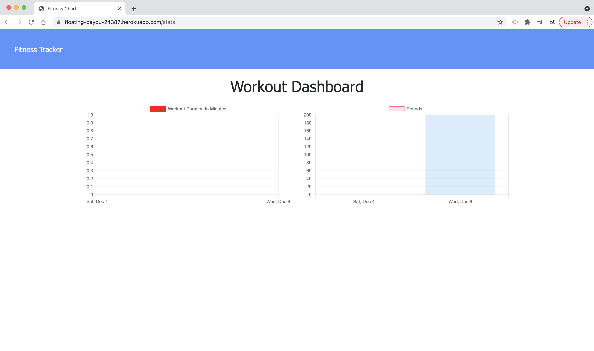

# Zaragoza-HW-Wk18-FitnessTracker

## Description
In this repository you will find files for a simple "fitness tracker" that receives user input to log and save daily workouts. Users add exercises to their workouts along with other pertinent information such as a number of sets and reps for weight/resistance training, or distance goals for cardio. The most recently recorded workout will appear upon loading the application, and user stats from previous workouts are also charted on a dashboard.

## Table of Contents
- [Installation](#installation)
- [Testing](#testing)
- [Contributions](#contributions)
- [License](#license)
- [Contact](#contact)

## Installation
The application may be forked from this repository. Once inside the folder on your local computer, run an NPM install for this application to run. Additionally this application is available to use at the deployed Heroku site here: [https://floating-bayou-24387.herokuapp.com/](https://floating-bayou-24387.herokuapp.com/).

This application utilizes MongoDB and Mongoose, and also Mongo Atlas to connect and deploy to the above Heroku site.

## Testing
This application was tested locally within the developer's browser.

## Contributions
Users are welcome to download or fork/clone this repository and add improvements or updates. Feel free to reach out below as well!

## License
© 2021 Greg Zaragoza

This project is protected under the MIT license. For more information, please visit [https://opensource.org/licenses](https://opensource.org/licenses).

## Contact
This project was created by Greg Zaragoza and can be found at [https://github.com/ggzaragoza](https://github.com/ggzaragoza).

For further information, feel free to email the author at greg.g.zaragoza@gmail.com with any questions about the project or regarding future updates or other issues.
